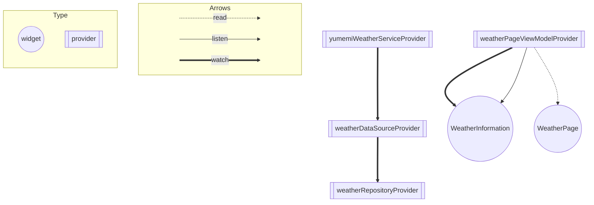
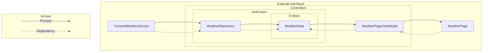

# 状態管理の構造

```mermaid
flowchart TB
  subgraph Arrows
    direction LR
    start1[ ] -..->|read| stop1[ ]
    style start1 height:0px;
    style stop1 height:0px;
    start2[ ] --->|listen| stop2[ ]
    style start2 height:0px;
    style stop2 height:0px;
    start3[ ] ===>|watch| stop3[ ]
    style start3 height:0px;
    style stop3 height:0px;
  end
  subgraph Type
    direction TB
    ConsumerWidget((widget));
    Provider[[provider]];
  end

  weatherPageViewModelProvider[["weatherPageViewModelProvider"]];
  weatherDataSourceProvider[["weatherDataSourceProvider"]];
  yumemiWeatherServiceProvider[["yumemiWeatherServiceProvider"]];
  weatherRepositoryProvider[["weatherRepositoryProvider"]];
  WeatherInformation((WeatherInformation));
  WeatherPage((WeatherPage));

  weatherPageViewModelProvider ==> WeatherInformation;
  weatherPageViewModelProvider --> WeatherInformation;
  weatherPageViewModelProvider -.-> WeatherPage;
  yumemiWeatherServiceProvider ==> weatherDataSourceProvider;
  weatherDataSourceProvider ==> weatherRepositoryProvider;
```

# クリーンアーキテクチャとの対応

```mermaid
flowchart TB
 subgraph External Interfaces
    subgraph Controllers
      WeatherPageViewModel
      subgraph UseCases
        WeatherRepository
        subgraph Entities
          WeatherData
        end
      end
    end
    YumemiWeatherService
    WeatherPage
  end
  YumemiWeatherService ---> WeatherRepository
  WeatherRepository ---> WeatherData
  WeatherData ---> WeatherPageViewModel
  WeatherPageViewModel ---> WeatherPage

  YumemiWeatherService ..-> WeatherRepository
  WeatherRepository ..-> WeatherData
  WeatherPageViewModel ..-> WeatherData
  WeatherPage ..-> WeatherPageViewModel

  subgraph Arrows
    start0[ ] ---> | Process | stop0[ ]
    style start0 height:0px;
    style stop0 height:0px;

    start1[ ] ..-> | Dependency | stop1[ ]
    style start1 height:0px;
    style stop1 height:0px;
    
  end
```